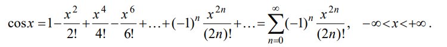
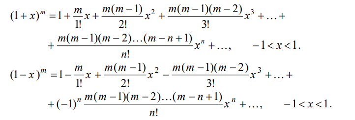

# Практическая работа №5: Ряды Маклорена

Этот проект реализует вычисление значений элементарных функций (косинус, \( (1+x)^m \), \( (1-x)^m \)) через ряды Маклорена с заданным количеством итераций.

## Описание проекта

Проект предоставляет интерфейс для вычислений с использованием рядов Маклорена. Пользователь может выбрать одну из нескольких функций и вычислить её значение для заданного \( x \) и \( m \).

### Реализованные функции

В проекте реализованы следующие функции:

- ***Косинус через ряд Маклорена***: \( \cos(x) \)
- ***\( (1+x)^m \) через ряд Маклорена***
- ***\( (1-x)^m \) через ряд Маклорена***

Каждая функция использует свой ряд Маклорена для вычислений до заданного числа итераций.

## Примеры использования

Пример работы программы:

```python
>>> 1
Введите значение x: 0.5
cos(0.5) ≈ 0.8775825618903728
```

## Чек-лист выполнения
- Реализован публичный удаленный репозиторий и связь с локальным.
- Реализованы функции для косинуса, (1+x)^m, (1-x)^m через ряды Маклорена.
- Реализовано меню выбора функции для пользователя.
- Написана документация для всех функций.
- Оформлен файл README.md в соответствии с требованиями.
- Программа протестирована и работает корректно.

## Формулы



## Ссылки 
https://github.com/BiligmaZ/vvpd5

